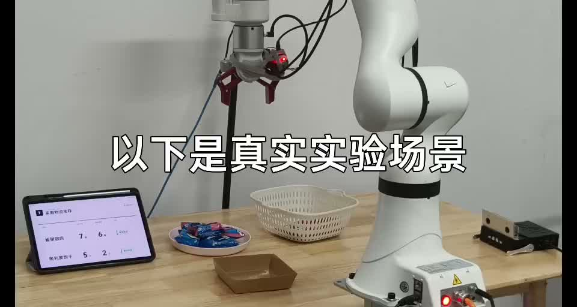
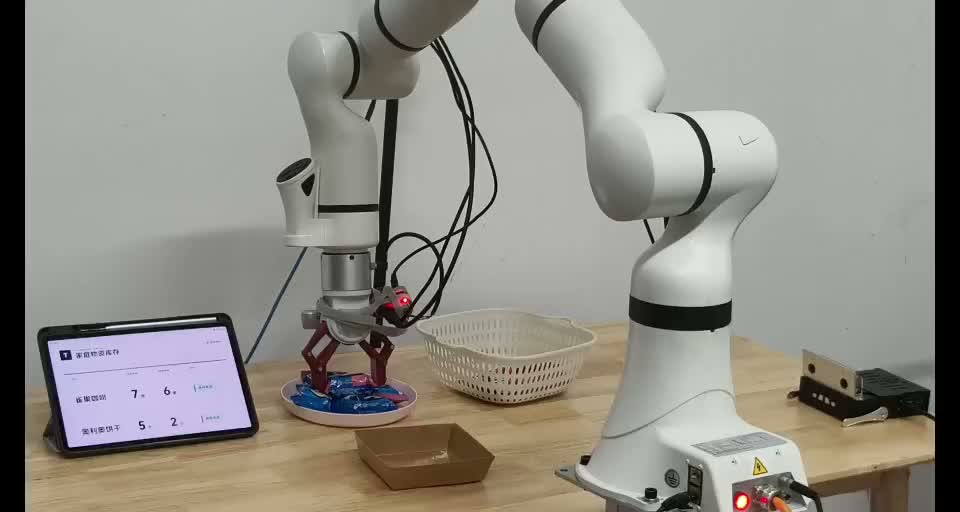
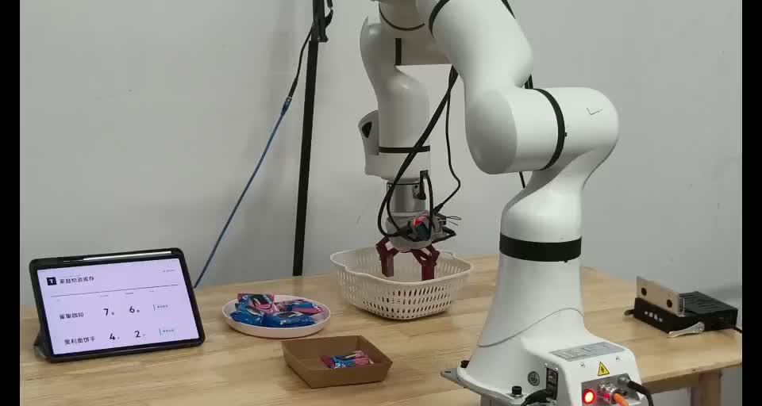
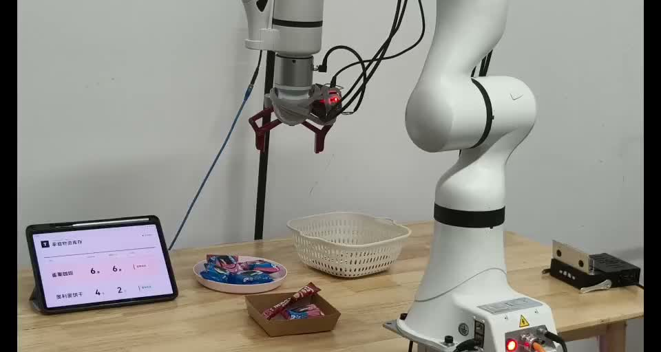

# TuntunClaw RDK X5

TuntunClaw is a memory-aware household inventory and manipulation assistant
built for the Robotics Dream Keeper Challenge, Smart Life Robotics track. The
completed system combines RDK X5 edge perception and speech, a trained SmolVLA
policy, a ROKAE xMate ER3 Pro arm, persistent inventory, a tablet dashboard,
and threshold-triggered replenishment warnings.

- Participant: Kewei Chen
- Final demo: https://youtu.be/mVvQPtZMKm4
- Discord thread: https://discord.com/channels/1300358874280230994/1503706103752429618/threads/1506248828523905105
- Showcase PR: https://github.com/D-Robotics/Robotics-Dream-Keeper-Challenge/pull/9

## Delivered Workflow

```text
RDK X5 MIPI camera -> BPU perception --------------------+
                                                         |
two live RGB cameras + 7-joint state -> trained SmolVLA
    -> safety-limited xCoreSDK commands -> ER3 Pro/LMG90
    -> gripper close/release candidate ------------------+
                                                         |
RDK fixed-camera tray ROI -> multi-frame occupancy check-+
                                                         v
SQLite inventory -> SSE tablet dashboard -> threshold decision
                                           -> Magic Box voice warning
```

The project team completed SmolVLA fine-tuning and deployed the trained policy
on an NVIDIA RTX PRO 6000 96 GB GPU.
The real-robot entry point in `smolvla/run_policy.py` executes online policy
outputs; it does not replay a recorded trajectory. Checkpoint weights are kept
outside Git because of their size and are selected through `smolvla/config.json`.

The physical task starts with five Oreo cookies (threshold two) and seven
Nestle coffee sticks (threshold six). After one Oreo is delivered, inventory
changes `5 -> 4` without an alert. After one coffee is delivered, inventory
changes `7 -> 6`; the `quantity <= threshold` rule updates the tablet and asks
the Magic Box to announce a replenishment warning.

## Quick Start

Prerequisites are Windows 11, Conda, NVIDIA CUDA, Git, OpenSSH, ROKAE xCoreSDK
Python 0.7.0, and a configured RDK X5 Magic Box reachable by SSH.

```powershell
git clone https://github.com/Ethan-Chen-plus/rdk-x5-smart-inventory-robot.git
cd rdk-x5-smart-inventory-robot
powershell -ExecutionPolicy Bypass -File scripts/setup_host.ps1
Copy-Item smolvla/config.example.json smolvla/config.json
# Edit checkpoint, xcore_sdk_root, cameras, COM port, and item_id.
```

Copy the repository to the board once:

```powershell
scp -r . sunrise@192.168.127.10:/home/sunrise/rdk_inventory_demo
```

Run the complete workflow. Without `-Execute` it performs camera, model,
controller, and inventory checks but does not move the robot.

```powershell
powershell -ExecutionPolicy Bypass -File scripts/start_complete_demo.ps1 -ItemId 2
powershell -ExecutionPolicy Bypass -File scripts/start_complete_demo.ps1 -ItemId 2 -Execute
```

For coffee, use `-ItemId 1`. The tablet opens
`http://<laptop-lan-ip>:8088/`; the administrator view is `/admin`.

```powershell
powershell -ExecutionPolicy Bypass -File scripts/stop_complete_demo.ps1
```

Detailed installation, training, checkpoint selection, dry-run, physical
execution, and emergency-stop behavior are in [smolvla/README.md](smolvla/README.md).

## Reproducibility Map

| Component | Entry point |
|---|---|
| RDK X5 BPU, ROS 2 detection, microphone | `scripts/start_stage3_demo.sh` |
| Magic Box ASR/TTS | `scripts/start_inventory_voice.sh` |
| Persistent inventory, threshold rule, tablet SSE, voice call | `inventory_web/app.py` |
| RDK tray-occupancy confirmation and key-frame validation | `docs/VISUAL_CONFIRMATION.md` |
| Recording-to-LeRobot conversion | `smolvla/convert_recordings.py` |
| SmolVLA fine-tuning | `smolvla/train_smolvla.ps1` |
| SmolVLA online inference, xCoreSDK arm, LMG90, completion event | `smolvla/run_policy.py` |
| Complete host/board launch | `scripts/start_complete_demo.ps1` |
| MuJoCo TuntunClaw simulation | `simulation/tuntunclaw/` |

## Evidence

RDK X5 sustained 30.02 FPS over 644 samples with 24.61 ms average BPU
inference latency. See [docs/BENCHMARK.md](docs/BENCHMARK.md) and the raw log in
`evidence/stage3_live_yolo_bpu.txt`.

| Initial setup | Oreo retrieval |
|---|---|
|  |  |

| Coffee retrieval | Low-stock state |
|---|---|
|  |  |

## Engineering Documents

- [Stage 2 package](docs/STAGE2_SUBMISSION.md)
- [Stage 3 package](docs/STAGE3_SUBMISSION.md)
- [Architecture and interfaces](docs/ARCHITECTURE.md)
- [Stage 2 to Stage 3 traceability](docs/TRACEABILITY.md)
- [Bill of materials](hardware/BOM.md)
- [Benchmark](docs/BENCHMARK.md)
- [Roadmap](docs/ROADMAP.md)
- [Risk and safety status](docs/RISK_ANALYSIS.md)

The completed MuJoCo system includes OpenClaw task planning, VLM + SAM object
understanding, GraspNet pose inference, continuous pick-and-place, persistent
scene state, location memory, inventory memory, and replenishment reminders.
Its source snapshot is included under `simulation/tuntunclaw/`.

## License

Project-owned code is Apache-2.0. Third-party source, model weights, datasets,
hardware SDKs, and assets retain their own licenses. The proprietary ROKAE SDK
and its license file are not redistributed.
