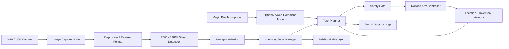
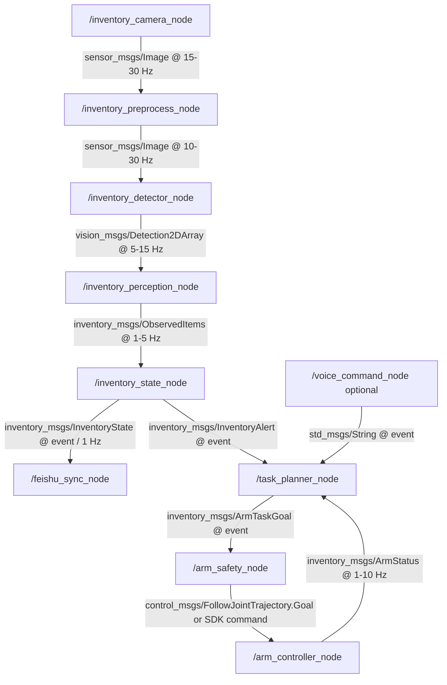

# System Architecture

Version: 0.1  
Updated: 2026-06-05

## Goal

TuntunClaw RDK X5 is a memory-aware household inventory and manipulation
assistant. RDK X5 provides on-device perception and multimodal interaction;
OpenClaw coordinates tasks and memory; the manipulation layer executes and
verifies safe household actions.

The manipulation workflow has been validated in MuJoCo with VLM + SAM target
segmentation, GraspNet grasp inference, continuous scene state, and inventory
memory. Stage 3 connects the verified physical RDK X5 perception pipeline to a
real robotic arm without presenting unverified hardware actions as complete.

The Stage 2 design goal is to make the final Stage 3 demo executable: every major module has a clear input, output, runtime owner, and test target.

## Operating Scenario

| Item | Target |
|---|---|
| Environment | Indoor desk, shelf, or storage-box scene |
| Lighting | Normal room lighting, with optional fill light for low-light tests |
| Items | Small household supplies, packages, containers, or labeled demo objects |
| Interaction distance | Camera view covers one storage area at a time |
| Human interaction | User asks for inventory state or triggers a scripted demo |
| Safety boundary | Robotic arm stays inside a predefined low-speed workspace |

## System Flow

## Runtime Decomposition

| Module | Process / Node | Main Responsibility | Input | Output | Real-time Constraint | Failure Mode |
|---|---|---|---|---|---|---|
| Image capture | `inventory_camera_node` | Capture frames from MIPI or USB camera | Camera stream | `/camera/image_raw` | 15-30 FPS | Camera unavailable, low light, dropped frames |
| Preprocess | `inventory_preprocess_node` | Resize, crop, convert image format | `/camera/image_raw` | `/inventory/image_input` | Below 15 ms per frame | Wrong color format, high CPU load |
| BPU detection | `inventory_detector_node` | Run object detection/classification on RDK X5 BPU | `/inventory/image_input` | `/inventory/detections` | Target 10+ FPS for demo | Model unsupported, low confidence |
| Perception fusion | `inventory_perception_node` | Stabilize detections across frames and map to item IDs | `/inventory/detections` | `/inventory/items_observed` | Update within 500 ms | Duplicate item IDs, unstable boxes |
| Inventory state | `inventory_state_node` | Maintain quantity, location, status, low-stock state | `/inventory/items_observed` | `/inventory/state`, `/inventory/alerts` | Event-driven | Stale records, sync conflict |
| Feishu sync | `feishu_sync_node` | Push structured inventory data to Feishu Bitable | `/inventory/state` | Remote table update result | Non-real-time | Network error, API error |
| Task planner | `task_planner_node` | Convert inventory events into arm or notification tasks | `/inventory/alerts`, user command | `/arm/task_goal`, `/system/status` | Below 1 s for scripted demo | Unsafe or unreachable task |
| Safety gate | `arm_safety_node` | Validate workspace, speed, collision assumptions, manual stop | `/arm/task_goal` | `/arm/safe_goal` | Must block unsafe commands immediately | Workspace limit violation |
| Arm control | `arm_controller_node` | Execute pointing, pick, move, or sorting routine | `/arm/safe_goal` | `/arm/status` | Low-speed deterministic action | Serial/SDK error, grasp failure |

## ROS 2 Node Graph

## Compute Allocation

| Component | RDK X5 BPU | RDK X5 CPU | Host / Cloud | Notes |
|---|---:|---:|---:|---|
| Object detection | Primary | Pre/post-processing | No | Use BPU for demo inference and benchmark evidence |
| Tracking / smoothing | No | Primary | No | Lightweight temporal filtering is enough for Stage 3 |
| Inventory database | No | Primary | Optional Feishu sync | Local state remains available if network fails |
| Task planning | No | Primary | No | Rule-based planner for reliability |
| Robotic arm control | No | Primary | No | Use vendor SDK/serial/ROS bridge depending on arm |
| Documentation / dashboard | No | Optional | Feishu/GitHub | Not required for real-time loop |

Expected resource targets for the demo:

- Detection pipeline: 10+ FPS for a shelf-level scene.
- BPU inference latency: record average and range from RDK logs.
- CPU load: keep enough headroom for ROS 2, logging, and arm control.
- End-to-end alert latency: below 2 seconds from item observation to state update.

## Process and Timing Plan

| Module | Thread / Process | CPU Affinity Plan | Timing Target |
|---|---|---|---|
| Camera capture | ROS 2 process | Default scheduler | Stable 15-30 FPS |
| Preprocess | ROS 2 process or composable node | Optional separate core if CPU-bound | Below 15 ms |
| BPU detector | ROS 2 process using RDK runtime | Default plus BPU runtime | 10+ FPS target |
| Inventory state | ROS 2 process | Default scheduler | Event update below 500 ms |
| Feishu sync | Background process | Low priority | Retry without blocking robot loop |
| Planner and safety | ROS 2 process | Default scheduler | Block unsafe goals immediately |
| Arm controller | ROS 2 process or SDK daemon | Default scheduler | Low-speed stable execution |

## Data Model

| Field | Example | Purpose |
|---|---|---|
| `item_id` | `paper_towel_001` | Stable internal inventory ID |
| `label` | `paper towel` | Human-readable class or item name |
| `location` | `shelf_A_slot_2` | Storage position |
| `quantity_estimate` | `2` | Count or approximate quantity |
| `confidence` | `0.84` | Detection confidence or fused score |
| `last_seen_at` | ISO timestamp | Freshness of observation |
| `status` | `normal`, `low_stock`, `missing`, `unknown` | Inventory state |
| `recommended_action` | `remind`, `point`, `sort_demo` | Planner hint |

## Safety Design

- The arm demo starts with pointing or scripted movement before any grasping.
- All arm actions are limited to a predefined workspace and low speed.
- The planner requires a valid item location before sending an arm command.
- The safety gate rejects goals with unknown coordinates, high speed, or missing manual approval.
- A manual stop path must be available during physical tests.

## Stage 3 Demo Path

1. Start camera and BPU detector on RDK X5.
2. Show live detection results for household supply objects.
3. Convert detections into inventory records.
4. Trigger a low-stock or selected-item event.
5. Use the robotic arm to point to or interact with the selected item.
6. Show logs, benchmark evidence, and Feishu/GitHub documentation.
