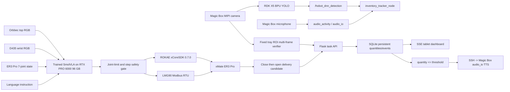

# Final System Architecture

Version: 1.0
Updated: 2026-07-16

## Runtime Topology



RDK X5 owns the challenge edge-perception and voice path. The Windows host
owns the trained SmolVLA policy, vendor arm SDK, gripper serial interface, and
inventory web service. The tablet is a read-only LAN client. This split is
intentional: xCoreSDK and SmolVLA run on the available x86/CUDA deployment
target, while camera inference and speech remain on RDK X5.

## Implemented Processes and Interfaces

| Owner | Process / entry | Input | Output | Rate / trigger |
|---|---|---|---|---|
| RDK X5 | Magic Box YOLO demo | MIPI NV12 960x544 | `/hobot_dnn_detection` | 30.02 FPS measured |
| RDK X5 | `audio_activity_node.py` | ALSA two-channel 16 kHz | `/audio/activity` | 10 Hz |
| RDK X5 | `inventory_tracker_node.py` | detection + audio topics | `/inventory/state`, atomic JSON | 1 Hz |
| RDK X5 | `rdk_roi_verifier_node.py` | official camera WebSocket, fixed empty-tray reference | baseline/final task API evidence | 15 stable frames per phase |
| RDK X5 | ROS 2 `audio_io` | `/tts_text` / microphone | speaker / `/prompt_text` | event-driven |
| Host | `smolvla/run_policy.py` | two RGB frames, 7 joints, language | 8-D absolute action | configured 4 Hz |
| Host | xCoreSDK 0.7.0 | seven bounded joint targets | ER3 Pro NRT commands | one command/policy step |
| Host | LMG90 Modbus | width and force registers | gripper motion | one command/policy step |
| Host | `inventory_web/app.py` | robot completion/admin API | SQLite, JSON, SSE, TTS call | event-driven; SSE keepalive 15 s |
| Tablet | browser `/` | SSE `/api/events` | live quantity/threshold table | immediate on state change |

The physical inventory is not inferred by recounting an occluded source pile.
The manipulation controller first reports a model-driven gripper close/release
as a candidate. The RDK fixed camera then compares 10 or more stable frames of
the delivery-tray ROI against its empty reference. Only a sufficient occupancy
increase commits one unit. The task ID identifies the requested item; an
optional two-class YOLO11 detector can add independent Oreo/coffee identity.

## API Contract

```http
POST /api/tasks/retrieval-start
Content-Type: application/json

{"item_id": 1, "task_id": "rollout-uuid"}
```

The RDK verifier posts a baseline before motion. Close/release then posts to
`/api/tasks/retrieval-candidate`; the final `/vision-confirm` request contains
multi-frame destination occupancy and confidence. Only that final transition
commits one unit to SQLite, evaluates the threshold, publishes tablet SSE, and
queues the Magic Box voice warning.

## Compute Allocation and Resource Budget

| Workload | Device | Verified / expected utilization |
|---|---|---|
| YOLO camera inference | RDK X5 Bayes BPU | 30.02 FPS and 24.61 ms mean inference verified; expected 30-70% BPU scheduling occupancy for this single model |
| Camera decode, ROS 2, JSON logging | RDK X5 8x A55 | expected 15-45% aggregate CPU; observed load average 2.04 with about 6.0 GiB RAM free |
| Microphone RMS or `audio_io` | RDK X5 CPU/audio DSP | expected 5-20% aggregate CPU; runs mutually exclusively because both own the microphone |
| SmolVLA inference | NVIDIA RTX PRO 6000 96 GB | CUDA FP16; expected 4.5-6.0 GB VRAM and one action chunk per control cycle |
| xCoreSDK, Modbus, Flask/SQLite | Windows host CPU | expected below 15% aggregate CPU outside video preprocessing |

Expected percentages are engineering operating ranges, not benchmark claims.
Measured RDK latency, FPS, temperature, memory, and load are preserved in
`docs/BENCHMARK.md` and `evidence/stage3_live_yolo_bpu.txt`.

## Folder Conventions

```text
assets/          photos and screenshots
docs/            challenge packages, architecture, benchmark, traceability
evidence/        raw RDK logs and captured state
hardware/        final BOM and safety information
inventory_web/   SQLite/SSE dashboard, API, tests
scripts/         board, host, and complete-system launch/stop scripts
simulation/      completed OpenClaw/VLM/SAM/GraspNet/MuJoCo implementation
smolvla/         dataset conversion, training, inference, arm/gripper bridge
src/             RDK ROS 2 Python nodes
```

Runtime data and secrets are never committed. `inventory.db`, model weights,
xCoreSDK binaries/license, credentials, and videos are external artifacts.

## Safety and Stop Paths

1. Software limits reject hardware-limit violations and cap a policy step to 2 degrees.
2. Physical motion requires `--execute` plus the exact interactive confirmation.
3. The robot must already be automatic and powered through RobotAssist/external enable.
4. `Ctrl+C` calls `robot.stop()` and clears queued motion.
5. The J5 handheld stop and external emergency stop are the immediate mechanical stop paths.
6. No project script changes servo power or bypasses the safety chain.
