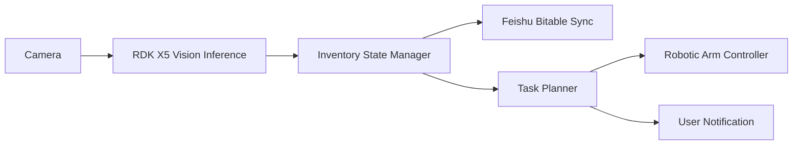

# Project Proposal

Version: 0.2
Updated: 2026-06-05

## Project Name

RDK X5 Smart Household Inventory Robot

## Track

Smart Life Robotics

## Scenario

The target scenario is household supply management. Many daily-use items are stored across shelves, drawers, or storage boxes, and users often forget item quantity, storage location, or replenishment timing.

This project uses RDK X5 and a real robotic arm to build a smart household inventory assistant that can perceive items, update inventory records, generate reminders, and demonstrate simple physical interaction with selected supplies.

The initial demo environment will be a controlled indoor shelf or desktop storage area. The system should work under normal room lighting, with the camera viewing one storage area at a time.

## User

The target users are home users, makers, and robotics learners who want a practical smart home robotics prototype.

The primary user interaction mode is inventory checking and task confirmation. The robot should be able to report what it sees, what is missing or low-stock, and what physical action it plans to perform.

## Core AI Capabilities

- Visual recognition of household supplies.
- Temporal smoothing for more stable item observations.
- Inventory state update and low-stock detection.
- Structured synchronization with Feishu Bitable.
- Task decision logic for notifications and robotic arm actions.

## Robotic Arm Integration

A real robotic arm will be introduced for physical interaction. The first prototype will focus on safe, simple actions:

- Point to a selected item.
- Pick or move lightweight demo objects.
- Sort items into predefined areas.
- Execute scripted demonstrations under speed and workspace limits.

## RDK X5 Role

RDK X5 will act as the edge AI computing unit:

- Run on-device object detection or classification.
- Provide perception results to the inventory and task modules.
- Support later ROS 2-aware integration with the robotic arm control layer.

Target measurable goals:

- 10+ FPS detection pipeline for the final demo scene.
- Below 2 seconds from item observation to inventory state update.
- At least one repeatable real-arm action linked to the detected or selected item.
- Public documentation with setup evidence, benchmark logs, and a demo video.

## Initial Architecture



Full architecture details are documented in [ARCHITECTURE.md](ARCHITECTURE.md).

## Innovation / Differentiation

The project is designed as a complete robot workflow rather than a single vision demo. It links RDK X5 BPU inference to inventory records, decision logic, and real robotic arm movement:

```text
camera -> BPU inference -> inventory state -> task planner -> safety gate -> robotic arm action
```

This creates a stronger smart-life robotics story: the robot is not only recognizing objects, but also maintaining household memory and acting in the physical environment.

## Expected Demo

The final demo should show:

1. RDK X5 detecting or classifying household items.
2. Inventory records being updated.
3. A low-stock or item-location reminder being generated.
4. A real robotic arm performing a simple interaction related to the detected item.

## Stage 2 Supporting Documents

- Stage 2 submission package: [STAGE2_SUBMISSION.md](STAGE2_SUBMISSION.md)
- Architecture and ROS 2 graph: [ARCHITECTURE.md](ARCHITECTURE.md)
- Roadmap: [ROADMAP.md](ROADMAP.md)
- Risk analysis: [RISK_ANALYSIS.md](RISK_ANALYSIS.md)
- BOM: [../hardware/BOM.md](../hardware/BOM.md)
