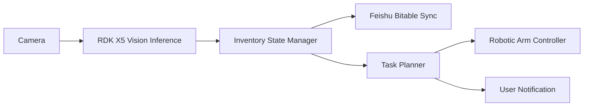

# Project Proposal

Updated: 2026-05-19

## Project Name

RDK X5 Smart Household Inventory Robot

## Track

Smart Life Robotics

## Scenario

The target scenario is household supply management. Many daily-use items are stored across shelves, drawers, or storage boxes, and users often forget item quantity, storage location, or replenishment timing.

This project uses RDK X5 and a real robotic arm to build a smart household inventory assistant that can perceive items, update inventory records, generate reminders, and demonstrate simple physical interaction with selected supplies.

## User

The target users are home users, makers, and robotics learners who want a practical smart home robotics prototype.

## Core AI Capabilities

- Visual recognition of household supplies.
- Inventory state update and low-stock detection.
- Structured synchronization with Feishu Bitable.
- Task decision logic for notifications and robotic arm actions.

## Robotic Arm Integration

A real robotic arm will be introduced for physical interaction. The first prototype will focus on safe, simple actions:

- Point to a selected item.
- Pick or move lightweight demo objects.
- Sort items into predefined areas.
- Execute scripted demonstrations under speed and workspace limits.

## RDK X5 Role

RDK X5 will act as the edge AI computing unit:

- Run on-device object detection or classification.
- Provide perception results to the inventory and task modules.
- Support later ROS 2-aware integration with the robotic arm control layer.

## Initial Architecture

## Expected Demo

The final demo should show:

1. RDK X5 detecting or classifying household items.
2. Inventory records being updated.
3. A low-stock or item-location reminder being generated.
4. A real robotic arm performing a simple interaction related to the detected item.

